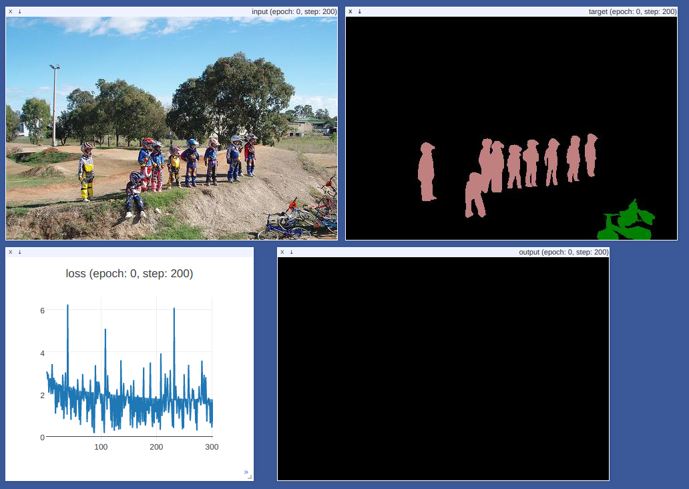

# FCN8s for semantic segmentation

This is a simple FCN8s[1] implementation in Pytorch. I think it is almost the same as original Caffe implementation, except:

* Adam optimizer is used in this one
* the output of Pool4 and Pool3 are sent into the subsequent conv layers without being multiplied by a small constant. 

Some of the code are borrowed from https://github.com/wkentaro/pytorch-fcn
and https://github.com/bodokaiser/piwise

Thank them very much. 

## Usage
Train:
	
	python main.py --phase train --data /media/xyz/Files/data/datasets --out ./checkpoint 
	
Test:
	
	python main.py --phase test --param /media/xyz/Files/fcn8s.pth --data /media/xyz/Files/images --out ./result 
	
(Assuming '/media/xyz/Files/data/datasets' is the path to VOC dataset, '/media/xyz/Files/fcn8s.pth' is the path to some pretrained parameters, and you have some images to segment in '/media/xyz/Files/images')

Visulization during training:

open http://localhost:8097/env/fcn in a browser 

## Reference
[1] Long, Jonathan, Evan Shelhamer, and Trevor Darrell. "Fully convolutional networks for semantic segmentation." Proceedings of the IEEE Conference on Computer Vision and Pattern Recognition. 2015.

